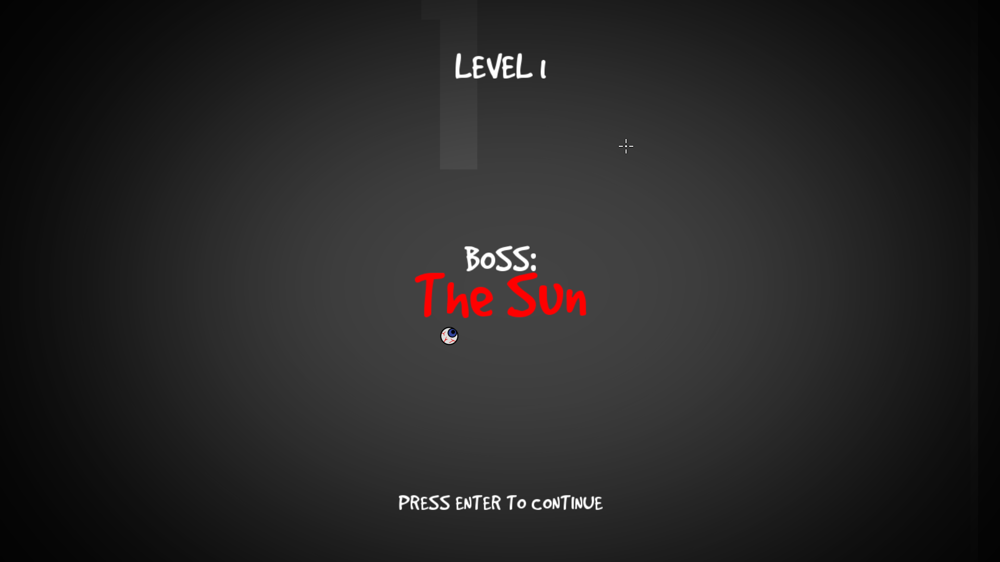
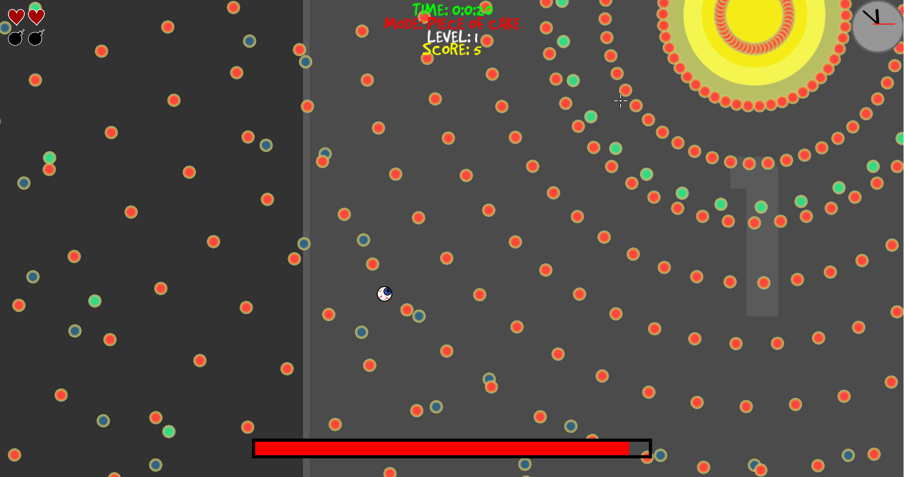
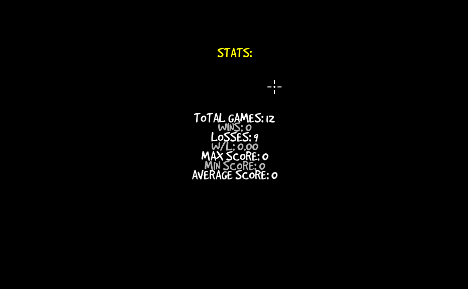
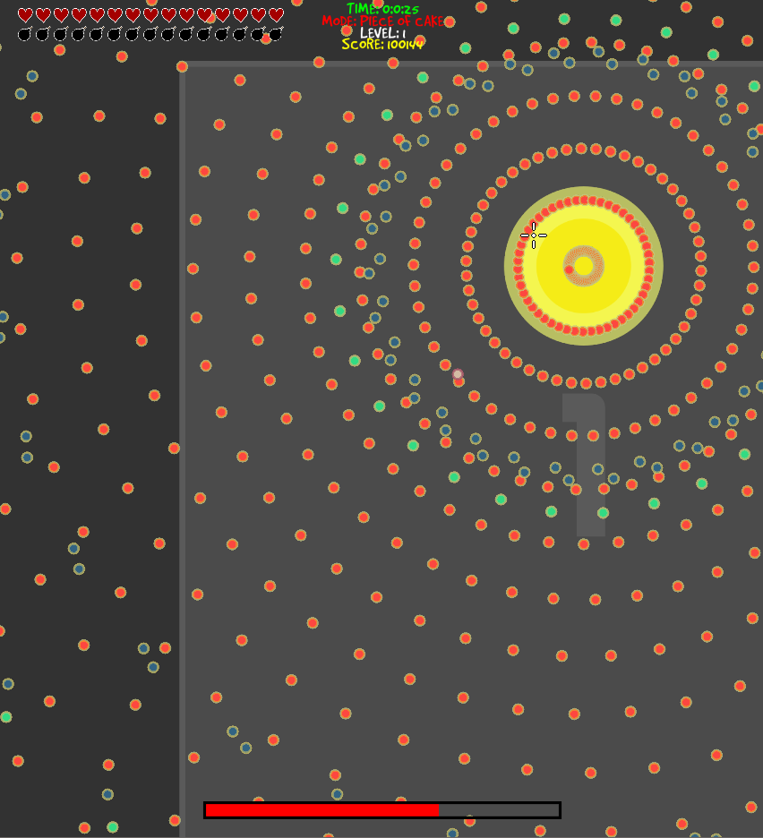
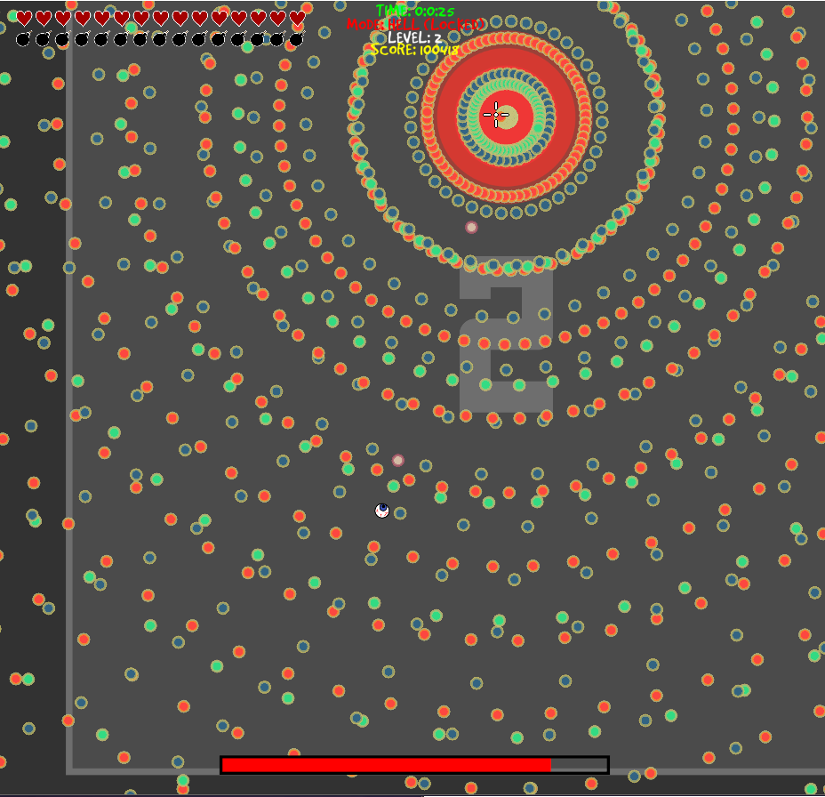
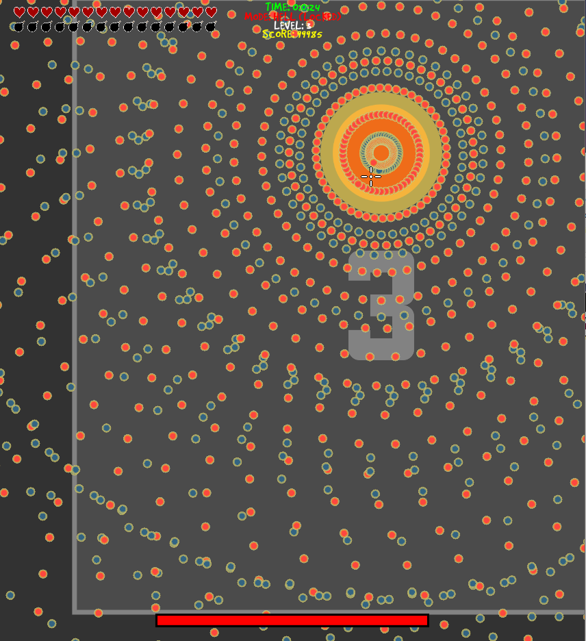
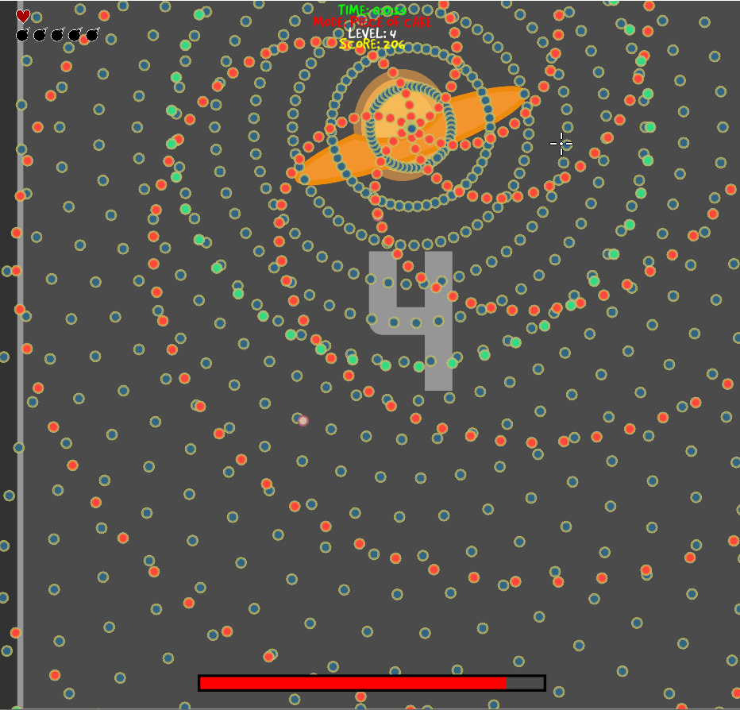
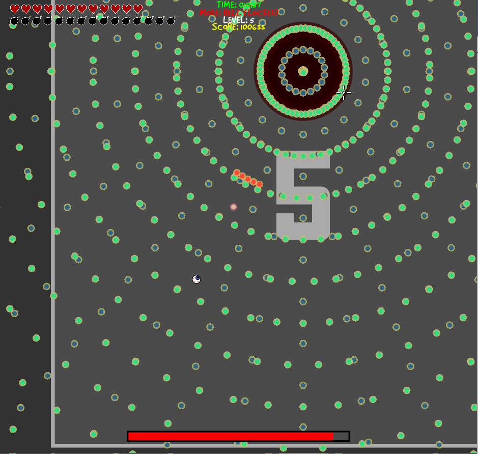

# Unfair
Though this is an **old project** I wrote years ago, I wanted to share it here on GitHub.
Unfair is a simple game written in **C++14** using **SFML**.

I gave it this name for his challenging difficulty which is pretty common for
**bullet-hell** games. 

## Features
  - 5 unlockable difficulty levels
  - 5 unique bosses to beat
  - Shoot with left click; move with WASD; bomb with Space, Q or right click
  - Each bullet has a velocity, acceleration, angular velocity, angular acceleration and more
  - In-game statistics (games played, wins, losses, average score, etc.)
  - Scores recording system
  - An embedded clock
  - Several visual options (V-sync, AntiAliasing, etc.)
  - In-game cheats which give you more lives and bombs or change level
  - Awful splash screen (press 'Escape' to skip)
  
## Screenshots
</img>
</img>
</img>

</img>
</img>
</img>
</img>
</img> 

# License
Unfair is licensed under the **Apache License 2.0** (read file 'LICENSE' for more info)
